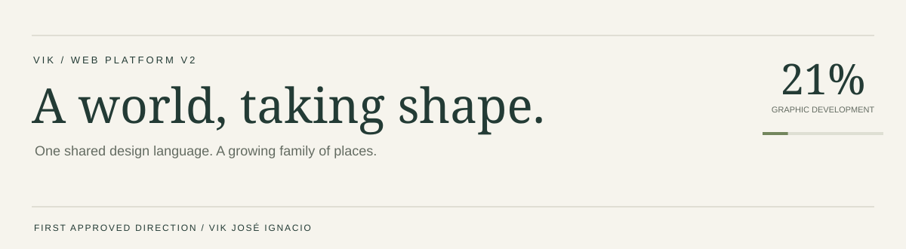
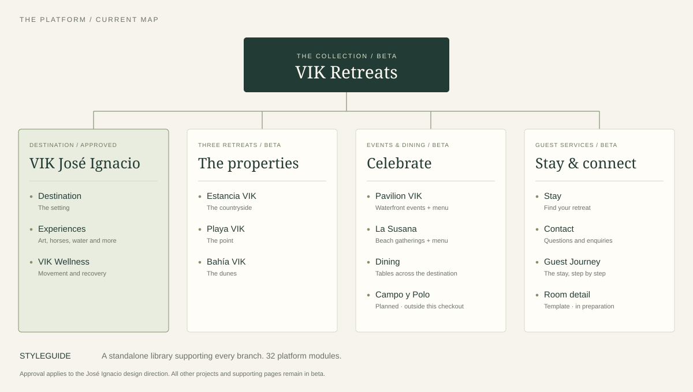

<a href="./vik-jose-ignacio/"><strong>Start with José Ignacio</strong></a> &nbsp; · &nbsp; <a href="./styleguide/"><strong>Explore the Styleguide</strong></a> &nbsp; · &nbsp; <a href="#the-platform">Follow the platform map</a>

This is where the next VIK web experience takes shape: a shared design language, brought to life across the collection.

**Graphic development is at 21%. VIK José Ignacio is the first and only approved design direction so far.** Every other project is still in beta. The percentage tracks graphic development, independently of the media upload.

## Two places to start

<table>
<tr>
<td width="50%" valign="top">
01 / THE FIRST APPROVED DIRECTION
<h3>VIK José Ignacio</h3>

The destination experience setting the tone: film, editorial storytelling, three retreats, and a connected world of art, food and nature.

<strong>Design approved · first upload priority</strong>

<a href="./vik-jose-ignacio/">Explore José Ignacio →</a>

</td>
<td width="50%" valign="top">
02 / THE SHARED BUILDING BLOCKS
<h3>Styleguide</h3>

A primary, standalone part of the platform. This is the workshop: all 32 modules in one place, showing the components we use to build the experience.

<strong>16 current modules + 16 library modules · beta</strong>

<a href="./styleguide/">Open the module library →</a>

</td>
</tr>
</table>

Styleguide sits outside the guest-facing page tree because it supports the whole platform. Its current modules come from the live design; the extended library keeps room layouts, overlays, enquiries and other reusable components available for the next pages.

## The platform

VIK Retreats is the front door. The tree below follows the existing platform map, with José Ignacio as the current focus. Supporting pages remain in beta, including those below the approved destination page.

| Branch | Pages & modules |
| :--- | :--- |
| **The collection** | [VIK Retreats](./vik-retreats/) |
| **José Ignacio** | [Destination home](./vik-jose-ignacio/) · [Destination](./destination/) · [Experiences](./experiences/) · [Wellness](./vik-wellness/) |
| **The properties** | [Estancia VIK](./estancia-vik/) · [Playa VIK](./playa-vik/) · [Bahía VIK](./bahia-vik/) |
| **Celebrate** | [Events hub](./celebrate/) · [Pavilion VIK](./pavilion-vik/) · [La Susana](./la-susana/) · [Dining](./dining/) |
| **Stay & connect** | [Stay](./stay/) · [Contact](./contact/) · [Guest Journey](./guest-journey/) |
| **Platform foundation** | [Styleguide](./styleguide/) · [Architecture reference](./flujo/) |

Pavilion VIK and La Susana each include a menu module. Campo y Polo appears in the source map but has no folder in this checkout. Room detail is marked as in preparation in that map; its working template lives below, away from the main navigation.

## Inside the Styleguide

<table>
<tr><td width="50%" valign="top">DISCOVER & EXPLORE<h3>A sense of place</h3>
Film covers, editorial collages, ecosystem rails, a retreat chooser, filtered mosaics and live maps.
</td><td width="50%" valign="top">DECIDE & CONNECT<h3>A clear next step</h3>
Season calendars, weekly agendas, press, reservations and the closing invitation.
</td></tr>
<tr><td valign="top">GO DEEPER<h3>The extended library</h3>
Room reels, overlays, gallery covers, specifications, artist cards and services.
</td><td valign="top">BUILD CONSISTENTLY<h3>One shared language</h3>
Navigation, booking strips, sub-navigation, accordions, enquiries and reusable editorial layouts.
</td></tr>
</table>

<strong>Browse all 32 modules</strong>

Names and IDs follow the current Styleguide. Open its index to inspect each working example.

| Current modules | Extended library |
| :--- | :--- |
| **M01** Bar, menu and booking strip | **L01** Interior page cover |
| **M02** Cover with the counter | **L02** Principles |
| **M03** Live ribbon | **L03** The overlay |
| **M04** The collage | **L04** Room reel |
| **M05** Ecosystem rail | **L05** The wall |
| **M06** The statement | **L06** The accordion |
| **M07** The chooser | **L07** Enquiry |
| **M08** Filtered mosaic | **L08** Split |
| **M09** The manifesto index | **L09** Pull quote |
| **M10** Full-bleed band with calendar | **L10** Sub-navigation |
| **M11** The index | **L11** Gallery cover |
| **M12** The week | **L12** Specification bar |
| **M13** Live map | **L13** What is included |
| **M14** Press | **L14** Artist cards |
| **M15** The reservation | **L15** Breadcrumb |
| **M16** The closing | **L16** Services |

[Open Styleguide source](./styleguide/index.html)

<strong>Workbench · supporting pages, templates & wider branches</strong>

These stay available without crowding the main platform view.

| Area | What's here |
| :--- | :--- |
| Room detail | [Working template](./room/) — in preparation in the source map |
| Property detail | [Bahía room pages](./bahia-vik/cuartos/) — supporting property routes |
| Menus | [Pavilion VIK](./pavilion-vik/menu.html) · [La Susana](./la-susana/menu.html) |
| Architecture | [Platform map](./flujo/index.html) · [Route directory](./flujo/links.html) |
| Earlier explorations | Existing files prefixed with `_legacy` or `_v1`; kept out of the main navigation |
| Wider collection | Galleria VIK Milano, VIK Chile and VIK Wines appear in the wider source map; they are outside this local media upload |

<strong>Media · inventory & upload order</strong>

José Ignacio comes first, followed by the beta projects. Within each group: shared assets and typography, images from lightest to heaviest, then video. The inventory records the selected files and their publication status.

Selection follows the current pages and their code dependencies, including responsive images, gallery content, posters and mobile video variants. Unreferenced media and media used only by older page versions are left out. This is a reference audit, not a visual review of every interaction.

[View the complete media inventory](./MEDIA-INVENTORY.md)

<strong>Development · files & local preview</strong>

- `_core/` — shared styles and behaviour.
- `_assets/` and `assets/` — common media and design resources.
- Project folders — pages, local assets and supporting code.
- `docs/` — README presentation assets.

Serve the repository root with a static server, then open `/vik-jose-ignacio/` or `/styleguide/`. GitHub folder links show source files; a live site deployment is separate.

